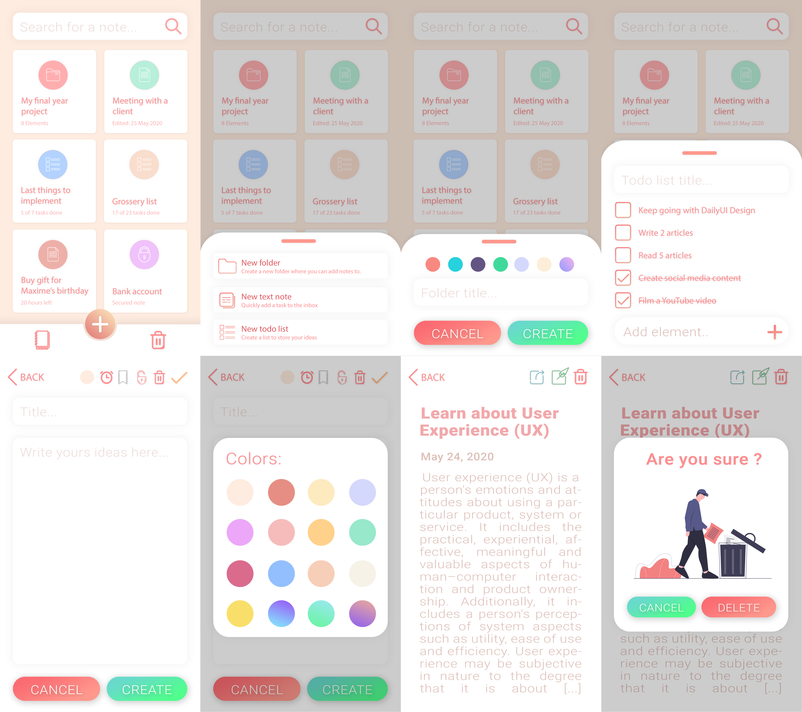

   

EasyNotes is an easy to use notes app with folders to manages your ideas and projects.

## Installation
Here is the procedure to install this software :
1. Download the *.APK* in the release section
2. Install it on your Android device
3. Run it

## Development environment
* Flutter:
    * Install Android Studio: [Install](https://developer.android.com/studio)
    * Install the Flutter extension for Android Studio: [Install](https://flutter.dev/docs/get-started/editor)
    * Clone the current [project](https://github.com/qanastek/EasyNotes)
    * Open it & build the project

## References
* [Dribble](https://dribbble.com/)
* [Behance](https://www.behance.net/)
* [Illustrations](https://undraw.co/illustrations)
* [Some Icons](http://flaticon.com/)